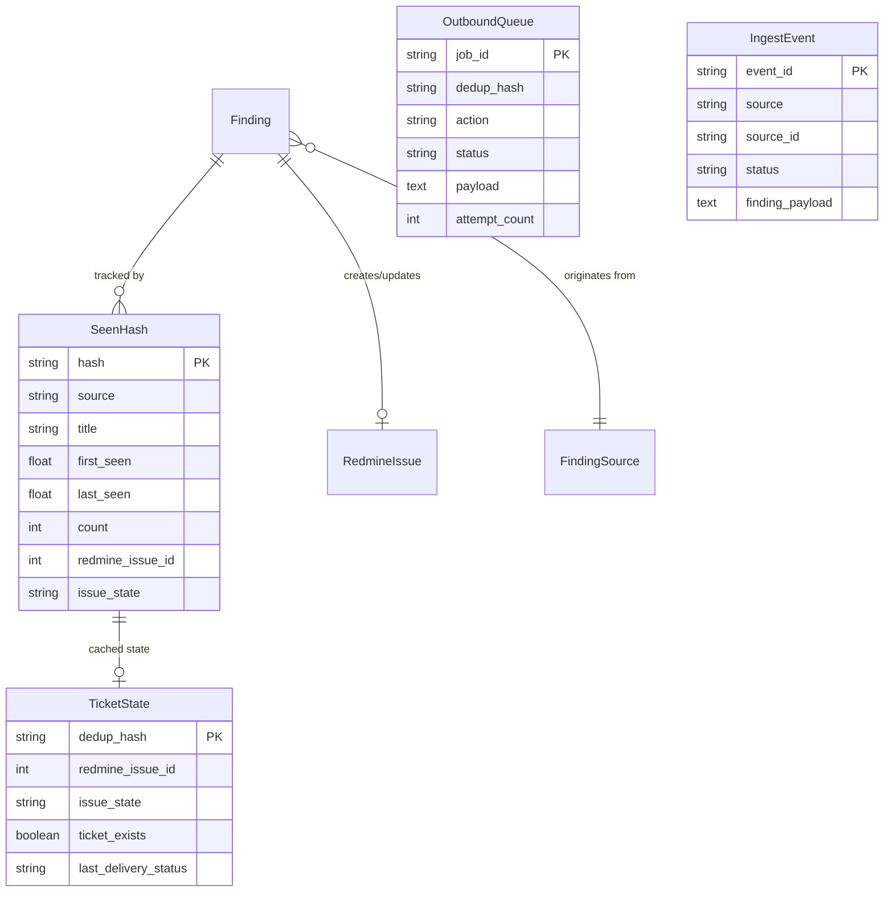

# Backend Documentation

## Security Middleware Pipeline — Backend Architecture

---

## 1. Architecture Overview

The backend is a **modular monolith** written in Python. It follows a **pipeline architecture** where security findings flow through discrete processing stages. An optional **Flask web server** runs alongside for configuration management and webhook ingestion.

```
┌──────────────┐     ┌──────────────────────────────────────────────────┐     ┌──────────┐
│ Wazuh SIEM   ├────►│              MIDDLEWARE PIPELINE                 ├────►│ Redmine  │
│ (Indexer/    │     │                                                  │     │ Issue    │
│  File/Push)  │     │  Ingest → Filter → Severity Map → Dedup → Enrich│     │ Tracker  │
└──────────────┘     │                                                  │     └──────────┘
                     │  ┌─────────┐  ┌────────────┐  ┌──────────────┐  │
┌──────────────┐     │  │ Flask   │  │ State Store│  │  Dashboard   │  │
│ DefectDojo   ├────►│  │ Web UI  │  │ SQLite/PG  │  │  History     │  │
│ (REST API)   │     │  └─────────┘  └────────────┘  └──────────────┘  │
└──────────────┘     └──────────────────────────────────────────────────┘
```

### Execution Modes

| Mode | Command | Description |
|------|---------|-------------|
| **Continuous polling** | `python -m src.main` | Pipeline + Web UI on port 5000 |
| **Single cycle** | `python -m src.main --once` | One fetch→process→output cycle, then exit |
| **Pipeline only** | `python -m src.main --no-web` | No web UI, polling loop only |
| **Web UI only** | `python -m web.server` | Config editor + webhook receiver |
| **Connection test** | `python -m src.main --test` | Verify Wazuh/DefectDojo/Redmine connectivity |
| **Delivery worker** | `python -m src.main --delivery-worker` | Async Redmine job processor (Postgres mode) |
| **Decision worker** | `python -m src.main --decision-worker` | Store-first ingest processor (Postgres mode) |

---

## 2. Technologies & Dependencies

| Package | Version | Purpose |
|---------|---------|---------|
| **Python** | 3.11+ | Runtime |
| **Flask** | ≥3.0.0 | Web server for config UI and webhooks |
| **requests** | ≥2.31.0 | HTTP client for Wazuh, DefectDojo, Redmine APIs |
| **PyYAML** | ≥6.0.1 | Configuration file parsing |
| **python-redmine** | ≥2.5.0 | Redmine API helper (available but direct REST used) |
| **APScheduler** | ≥3.10.4 | Task scheduling (available for future use) |
| **python-dotenv** | ≥1.0.0 | Environment variable loading |
| **psycopg\[binary\]** | ≥3.2.0 | PostgreSQL driver (optional, for shared state) |
| **pytest** | ≥7.4.0 | Test framework |
| **responses** | ≥0.24.0 | HTTP mocking for tests |

### Database Choices

| Backend | Use Case | Details |
|---------|----------|---------|
| **SQLite** | Default (local mode) | Dedup hash registry at `data/dedup.db` |
| **PostgreSQL 16** | Shared state (multi-instance) | Dedup, checkpoints, ticket state, job queues, ingest events, dashboard |
| **JSONL file** | Dashboard history (local) | Append-only log at `data/dashboard_events.jsonl` |
| **JSON file** | DefectDojo checkpoint (local) | Incremental cursor at `data/defectdojo_cursor.json` |

---

## 3. Project Structure

```
security-middleware/
├── src/
│   ├── __init__.py
│   ├── main.py                    # Entry point, MiddlewarePipeline orchestrator
│   ├── config.py                  # YAML config loader with typed dataclasses
│   ├── state_store.py             # PostgresStateStore (shared state backend)
│   ├── dashboard_history.py       # Local JSONL dashboard event store
│   ├── models/
│   │   ├── __init__.py
│   │   └── finding.py             # Unified Finding dataclass + Severity/Source enums
│   ├── sources/
│   │   ├── __init__.py
│   │   ├── wazuh_client.py        # Wazuh Indexer + Manager + file reader client
│   │   └── defectdojo_client.py   # DefectDojo REST API v2 client
│   ├── pipeline/
│   │   ├── __init__.py
│   │   ├── filter.py              # Rule-based finding filter stage
│   │   ├── severity_mapper.py     # Source-native → unified severity mapper
│   │   ├── deduplicator.py        # SHA-256 hash dedup with TTL (SQLite/Postgres)
│   │   ├── enricher.py            # Asset metadata, remediation links, description formatting
│   │   └── identity.py            # Dedup hash generation + routing key resolution
│   └── output/
│       ├── __init__.py
│       └── redmine_client.py      # Redmine REST API client (create/update/reopen issues)
├── web/
│   ├── __init__.py
│   ├── server.py                  # Flask API server
│   └── static/                    # Frontend SPA files
├── tests/                         # Unit & integration tests (10 test files)
├── config/
│   └── config.yaml                # Primary configuration file
├── data/                          # Runtime data (dedup.db, cursors, history)
├── Dockerfile                     # Python 3.11-slim container
├── docker-compose.yml             # Middleware + Postgres stack
└── requirements.txt               # Python dependencies
```

---

## 4. Core Data Model

### Finding (Unified Schema)

All security findings from Wazuh and DefectDojo are normalized into a single `Finding` dataclass:

```python
@dataclass
class Finding:
    # Identity
    source: FindingSource          # WAZUH or DEFECTDOJO
    source_id: str                 # Original ID from source system
    title: str
    description: str

    # Severity
    severity: Severity             # INFO, LOW, MEDIUM, HIGH, CRITICAL
    raw_severity: str              # Original severity string/level

    # Context
    host: str                      # Affected hostname/IP
    srcip: str                     # Attacker origin IP
    endpoints: list[str]           # DefectDojo endpoints
    endpoint_url: str              # Web scanner target URL
    component: str                 # Dependency or system component
    routing_key: str               # Key for Redmine routing rules
    cvss: float | None             # CVSS score
    cve_ids: list[str]             # CVE identifiers
    tags: list[str]                # Classification tags
    timestamp: datetime
    rule_id: str | None            # Wazuh rule ID
    raw_data: dict                 # Full original payload

    # Pipeline metadata (set by pipeline stages)
    dedup_key: str                 # Human-readable identity key
    dedup_hash: str                # SHA-256 hash of dedup_key
    occurrence_count: int          # Collapsed repeat count
    redmine_issue_id: int | None   # Linked Redmine issue
    issue_state: str               # open, closed, missing
    action: str | None             # created, updated, reopened, failed, queued
    enrichment: dict               # Added by enricher stage
```

### Severity Mapping

| Wazuh Level | DefectDojo | Unified | Redmine Priority |
|-------------|------------|---------|------------------|
| 15 | Critical | `CRITICAL` | 5 (Immediate) |
| 12–14 | High | `HIGH` | 4 (Urgent) |
| 7–11 | Medium | `MEDIUM` | 3 (High) |
| 4–6 | Low | `LOW` | 2 (Normal) |
| 0–3 | Info | `INFO` | 1 (Low) |

### Data Relationships



---

## 5. Pipeline Stages

### Stage 1: Ingest

**Wazuh** (`wazuh_client.py`) — Three ingestion modes:
- **Indexer API**: OpenSearch query on `wazuh-alerts-*` indices with `search_after` pagination
- **File reader**: Tail-follow on `/var/ossec/logs/alerts/alerts.json` with file position tracking
- **Webhook**: Push alerts to `POST /api/webhook/wazuh`

**DefectDojo** (`defectdojo_client.py`):
- REST API v2 paginated polling with checkpoint-based incremental sync
- Scanner-aware endpoint normalization (ZAP, Tenable, generic)
- Two-phase checkpoint: fetch → pending → commit/discard after downstream success

### Stage 2: Identity Resolution (`identity.py`)

Generates deterministic dedup signatures per source:
- **Wazuh**: `source|rule_id|title|host|srcip|cve_ids`
- **DefectDojo/ZAP**: `source|found_by|endpoint_url|cwe|param|title`
- **DefectDojo/Tenable**: `source|found_by|endpoints|plugin_id|cves|title`
- **DefectDojo/Generic**: `source|found_by|asset_key|component|version|cves|title`

Final hash: `SHA-256("v3|{raw_key}")`

### Stage 3: Filter (`filter.py`)

Sequential filter rules — first match that fails drops the finding:

1. **Minimum severity**: `severity < min_severity` → drop
2. **Excluded rule IDs**: Wazuh rule_id in exclusion set → drop
3. **Host include patterns**: Host doesn't match any regex → drop
4. **Title exclude patterns**: Title matches any regex → drop
5. **Advanced JSON rules**: Evaluate conditions against `raw_data` payload (supports `equals`, `contains`, `regex`, `in`, `gt/gte/lt/lte`, `exists` operators)

### Stage 4: Severity Mapper (`severity_mapper.py`)

Maps source-native severity to unified scale and stores `redmine_priority_id` in enrichment.

### Stage 5: Deduplicator (`deduplicator.py`)

- Classifies findings as **new** or **repeat** based on hash presence within TTL window
- Same-batch duplicates are collapsed into one representative with `occurrence_count`
- **Two-phase commit**: New findings are NOT persisted until Redmine confirms success
- TTL-expired hashes are garbage collected after each cycle

### Stage 6: Enricher (`enricher.py`)

- Asset metadata from static YAML inventory
- Remediation links (NVD for CVEs, MITRE ATT&CK for technique IDs)
- Formatted Redmine description in Textile markup (source-specific templates)

### Stage 7: Output — Redmine (`redmine_client.py`)

Issue lifecycle management:

| Finding State | Action |
|---------------|--------|
| New (no issue ID) | Create new Redmine issue |
| Repeat (issue exists, open) | Add journal note with occurrence count |
| Repeat (issue closed) | Reopen issue + add note |
| Repeat (issue missing/deleted) | Recreate issue |
| API failure | Mark as failed, retry next cycle |

Routing rules determine tracker ID and parent issue linking per finding.

---

## 6. API Endpoints

### Configuration API

| Endpoint | Method | Description |
|----------|--------|-------------|
| `/api/config` | GET | Return current config with defaults applied |
| `/api/config` | POST | Save config JSON, auto-backup previous |
| `/api/config/raw` | GET | Return raw YAML text |
| `/api/config/raw` | POST | Save raw YAML with validation |
| `/api/config/validate` | POST | Validate config without persisting |
| `/api/config/backups` | GET | List backup files with metadata |
| `/api/config/backups/restore/:filename` | POST | Restore backup over active config |

### Connection Testing

| Endpoint | Method | Description |
|----------|--------|-------------|
| `/api/config/test/wazuh` | POST | Test Wazuh Manager + Indexer connectivity |
| `/api/config/test/defectdojo` | POST | Test DefectDojo API connectivity |
| `/api/config/test/redmine` | POST | Test Redmine API connectivity |

### External Service Integration

| Endpoint | Method | Description |
|----------|--------|-------------|
| `/api/redmine/trackers` | POST | Fetch available Redmine trackers |
| `/api/defectdojo/scope-data` | POST | Fetch products/engagements/tests |
| `/api/defectdojo/finding-count` | POST | Preview finding count for current filters |

### Webhook & Events

| Endpoint | Method | Description |
|----------|--------|-------------|
| `/api/webhook/wazuh` | POST | Receive push alerts from Wazuh |
| `/api/webhook/history` | GET | Return last 200 pipeline events |

### Sample API Request/Response

**POST /api/webhook/wazuh**
```json
// Request
[{
  "rule": { "id": "5710", "level": 12, "description": "sshd: attempt to login using a denied user" },
  "agent": { "name": "web-server-01", "ip": "10.0.1.50" },
  "data": { "srcip": "203.0.113.45", "dstip": "10.0.1.50" },
  "@timestamp": "2026-04-30T03:00:00+00:00"
}]

// Response (200 OK)
{
  "status": "ok",
  "stats": {
    "ingested": 1,
    "filtered": 0,
    "deduplicated": 0,
    "created": 1,
    "updated": 0,
    "failed": 0
  }
}
```

---

## 7. Configuration System

Configuration is loaded from `config/config.yaml` with environment variable overrides:

| Env Variable | Config Path |
|-------------|-------------|
| `WAZUH_BASE_URL` | `wazuh.base_url` |
| `WAZUH_USERNAME` | `wazuh.username` |
| `WAZUH_PASSWORD` | `wazuh.password` |
| `DEFECTDOJO_BASE_URL` | `defectdojo.base_url` |
| `DEFECTDOJO_API_KEY` | `defectdojo.api_key` |
| `STATE_BACKEND` | `storage.backend` |
| `STATE_POSTGRES_DSN` | `storage.postgres_dsn` |
| `REDMINE_BASE_URL` | `redmine.base_url` |
| `REDMINE_API_KEY` | `redmine.api_key` |

**Hot reload**: The pipeline checks `config.yaml` mtime each cycle and reloads all components if the file has changed.

---

## 8. Storage Architecture

### Local Mode (Default)

```
data/
├── dedup.db                    # SQLite — seen_hashes table (versioned schema)
├── defectdojo_cursor.json      # JSON — incremental checkpoint
└── dashboard_events.jsonl      # JSONL — append-only dashboard history
```

### Postgres Mode (Shared State)

Six tables created in the configured schema:

| Table | Purpose |
|-------|---------|
| `middleware_seen_hashes` | Dedup hash registry with TTL |
| `middleware_checkpoints` | DefectDojo incremental cursor |
| `middleware_ticket_state` | Cached Redmine ticket state |
| `middleware_outbound_queue` | Async Redmine delivery jobs |
| `middleware_ingest_events` | Store-first raw event persistence |
| `middleware_dashboard_events` | Dashboard history |

Postgres mode enables:
- **Multi-instance safety**: `FOR UPDATE SKIP LOCKED` for job claiming
- **Async delivery**: Decouple pipeline from Redmine API latency
- **Store-first ingest**: Persist raw events before any processing
- **Durable history**: Dashboard events survive process restarts

---

## 9. Scalability, Security & Performance

### Scalability

| Strategy | Implementation |
|----------|---------------|
| Horizontal scaling | Postgres backend + multiple pipeline workers |
| Async delivery | Outbound queue with configurable batch size and retry |
| Incremental polling | Checkpoint-based DefectDojo sync (no full re-scan) |
| Pagination | `search_after` for Wazuh, offset pagination for DefectDojo |
| Configurable intervals | `poll_interval`, `worker_poll_interval`, `worker_batch_size` |

### Security

| Concern | Mitigation |
|---------|-----------|
| Credential storage | Config file + env var overrides; never logged |
| SSL verification | Configurable per service (`verify_ssl`) |
| Input sanitization | Filename traversal check on backup restore |
| SQL injection | Parameterized queries (SQLite and Postgres) |
| API authentication | Wazuh JWT, DefectDojo Token, Redmine API key |
| Process hardening | systemd `NoNewPrivileges`, `ProtectSystem=strict` |

### Performance

| Optimization | Detail |
|-------------|--------|
| Batch processing | Findings processed in batches per cycle |
| Chunked DB queries | SQLite queries chunked at 500 to stay under variable limits |
| Connection pooling | Persistent `requests.Session` per service |
| Graceful shutdown | Signal handlers with per-second sleep increments |
| Config hot reload | mtime-based check avoids unnecessary reloads |

---

## 10. Testing

```bash
# Run all tests
python -m pytest tests/ -v

# Run specific test module
python -m pytest tests/test_pipeline.py -v
python -m pytest tests/test_deduplicator.py -v
```

| Test File | Coverage |
|-----------|----------|
| `test_config.py` | Config loading, validation, env overrides |
| `test_filter.py` | All filter rules including JSON conditions |
| `test_severity_mapper.py` | Wazuh level and DefectDojo string mapping |
| `test_deduplicator.py` | Hash tracking, TTL, same-batch dedup |
| `test_pipeline.py` | End-to-end pipeline cycle with mocked services |
| `test_defectdojo_client.py` | API parsing, checkpoint, endpoint normalization |
| `test_redmine_client.py` | Issue creation, update, routing |
| `test_state_store.py` | Postgres state store operations |
| `test_web_ui.py` | Flask API endpoints |

---

## 11. Deployment

### Docker

```bash
docker-compose up -d          # Start middleware + Postgres
docker-compose logs -f middleware  # View logs
docker-compose run middleware --once  # Single cycle
```

### systemd (Amazon Linux / EC2)

```bash
sudo systemctl enable security-middleware
sudo systemctl start security-middleware
sudo journalctl -u security-middleware -f
```

The service file reads credentials from `/etc/security-middleware/env` and restricts filesystem access to `/opt/security-middleware/data`.
