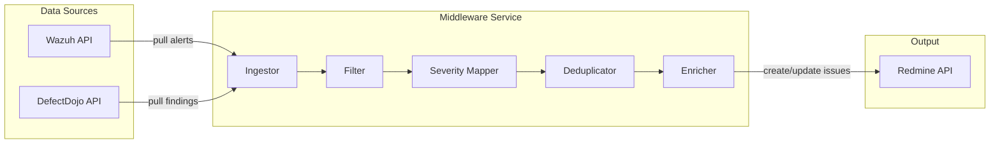

# Security Event Middleware Pipeline

Build a Python middleware service that ingests security findings from **Wazuh** and **DefectDojo**, processes them through a normalization pipeline (filter → map severity → deduplicate → enrich), and creates/updates tickets in **Redmine**.

---

## Architecture



---

## Proposed Project Structure

```
security-middleware/
├── config/
│   └── config.yaml              # All connection & rule settings
├── src/
│   ├── __init__.py
│   ├── main.py                  # Entry point / scheduler
│   ├── config.py                # Config loader
│   ├── sources/
│   │   ├── __init__.py
│   │   ├── wazuh_client.py      # Wazuh API client
│   │   └── defectdojo_client.py # DefectDojo API client
│   ├── pipeline/
│   │   ├── __init__.py
│   │   ├── filter.py            # Rule-based filtering
│   │   ├── severity_mapper.py   # Normalize severity to Redmine priority
│   │   ├── deduplicator.py      # Hash-based dedup with local state
│   │   └── enricher.py          # Add context (CVSS, asset info, links)
│   ├── output/
│   │   ├── __init__.py
│   │   └── redmine_client.py    # Redmine API client
│   └── models/
│       ├── __init__.py
│       └── finding.py           # Unified finding data model
├── tests/
│   ├── test_filter.py
│   ├── test_severity_mapper.py
│   ├── test_deduplicator.py
│   └── test_pipeline.py
├── docker-compose.yml           # Optional containerized setup
├── Dockerfile
├── requirements.txt
└── README.md
```

---

## Proposed Changes

### 1. Unified Finding Model

#### [NEW] `src/models/finding.py`
- Dataclass `Finding` — common schema for both Wazuh alerts and DefectDojo findings
- Fields: `source`, `source_id`, `title`, `description`, `severity`, `raw_severity`, `host`, `cvss`, `cve_ids`, `tags`, `timestamp`, `raw_data`, `enrichment`
- `dedup_hash()` method based on `(source, title, host, cve_ids)`

---

### 2. Source Clients

#### [NEW] `src/sources/wazuh_client.py`
- Connect to Wazuh API (`/security/user/authenticate` → JWT → `/alerts`)
- Fetch alerts since last run (timestamp-based cursor)
- Convert each alert → `Finding`

#### [NEW] `src/sources/defectdojo_client.py`
- Connect to DefectDojo API (`/api/v2/findings/`)
- Fetch active findings, paginated
- Convert each finding → `Finding`

---

### 3. Middleware Pipeline

#### [NEW] `src/pipeline/filter.py`
- Rule-based filtering from config: min severity, include/exclude rule IDs, host patterns
- Drop findings that don't match filter criteria

#### [NEW] `src/pipeline/severity_mapper.py`
- Map Wazuh levels (0–15) → unified scale (info/low/medium/high/critical)
- Map DefectDojo severity strings → same unified scale
- Map unified scale → Redmine priority IDs (configurable)

#### [NEW] `src/pipeline/deduplicator.py`
- SHA-256 hash of `(source, title, host, cve_ids)`
- SQLite-backed seen-hash store with TTL (configurable, default 7 days)
- Skip findings already seen within TTL window

#### [NEW] `src/pipeline/enricher.py`
- Add CVSS score lookup (from NVD or local cache)
- Add asset/host metadata from config-based asset inventory
- Add remediation links
- Format description with all enriched context

---

### 4. Redmine Output

#### [NEW] `src/output/redmine_client.py`
- Create issues via Redmine REST API (`/issues.json`)
- Map `Finding` → Redmine issue (project, tracker, priority, subject, description, custom fields)
- Check for existing open issue with same `dedup_hash` in custom field → update instead of create

---

### 5. Configuration

#### [NEW] `config/config.yaml`
- Wazuh: `base_url`, `username`, `password`, `verify_ssl`
- DefectDojo: `base_url`, `api_key`, `verify_ssl`
- Redmine: `base_url`, `api_key`, `project_id`, `tracker_id`, `priority_map`
- Pipeline: filter rules, severity mappings, dedup TTL, enrichment toggles
- Schedule: polling interval

---

### 6. Entry Point & Docker

#### [NEW] `src/main.py`
- Load config → init clients → run pipeline loop
- Schedule via `APScheduler` or simple `while True` + `time.sleep`
- Graceful shutdown, structured logging

#### [NEW] `Dockerfile` + `docker-compose.yml`
- Python 3.11 slim image
- Volume mount for config and SQLite DB

#### [NEW] `README.md`
- Setup instructions, config reference, architecture diagram

---

## User Review Required

> [!IMPORTANT]
> **API Access** — Do you have API credentials for Wazuh, DefectDojo, and Redmine ready? The implementation will use mock/placeholder URLs that you can configure via `config.yaml`.

> [!IMPORTANT]
> **Scope** — Should the middleware run as a **scheduled polling service** (pulls data every N minutes) or an **event-driven webhook receiver** (Wazuh/DefectDojo push to it)?

> [!IMPORTANT]
> **Redmine Custom Fields** — Do you have a custom field in Redmine for storing the dedup hash, or should we just rely on subject-line matching?

---

## Open Questions

1. **Polling vs. Webhook?** — Polling is simpler to implement; webhook requires an HTTP server. Which do you prefer?
2. **Redmine project structure** — Should all tickets go to one project, or should findings be routed to different projects based on rules?
3. **Enrichment depth** — Should we do live NVD/CVE lookups, or is basic metadata from Wazuh/DefectDojo sufficient?
4. **Authentication** — Any specific auth requirements (e.g., mTLS, API key rotation)?

---

## Verification Plan

### Automated Tests
- Unit tests for each pipeline stage (filter, severity mapper, deduplicator, enricher)
- Integration test with mocked API responses (using `responses` or `httpx_mock`)
- `python -m pytest tests/ -v`

### Manual Verification
- Run against real Wazuh/DefectDojo instances (or their demo environments)
- Verify Redmine tickets are created with correct severity, no duplicates
